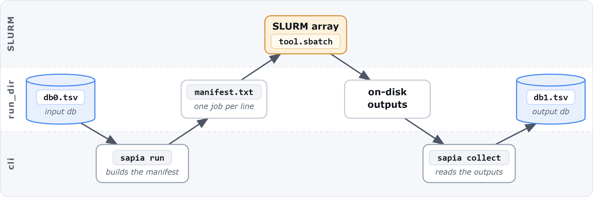
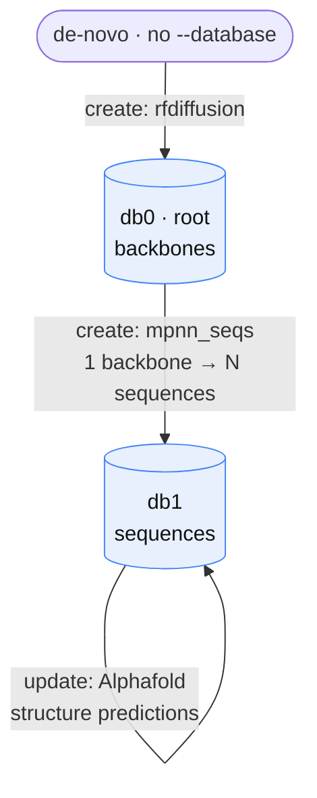

# prosapia

**A shared workbench for protein-design tools on HPC.** `prosapia` gives many heterogeneous protein-design tools (RFdiffusion, ProteinMPNN, AlphaFold3, ColabFold, Boltz, USalign, Rosetta, …) one bench to work on: a **shared database** every tool reads from and writes back to, and a **two-phase SLURM driver** that runs them on the cluster. Each tool sets its results on the bench and picks up what earlier tools left — so you bring the tools, and prosapia supplies the data format, the runner, and the lineage bookkeeping that ties their outputs together.

This is **not a pipeline framework.** There is no DAG to declare and no fixed order of steps. Instead there is a *consensus data format* — the database — and tools that consume and produce it. You compose a workflow dynamically by pointing the next tool at a database, exploring, forking, and back-tracking as the science demands. The database is the interface; the tools are interchangeable.

`prosapia` installs the **`sapia`** CLI and is meant to be used as a **library, not just a data store**: the same core functions the bundled tools are built from are yours to import. Bolt your own tool onto the bench in **two small functions** — a manifest builder and a collector — reshape a bundled tool, or use the bundled ones as-is.

> **Full documentation:** **[docs](docs/index.md)**.

---

## How it works in one picture

A design is a **row**; a database is a **table** (`.tsv`). Each tool contributes columns — a structure path, a sequence, a pLDDT, an RMSD — keyed by a design `name`. A tool never needs to know what ran before it; it reads the columns it needs and writes the columns it produces. That uniformity is what lets arbitrary tools compose without a hard-coded pipeline.

Every tool run has two phases against a `run_dir`:



The database is the durable record; the manifest is transient scaffolding for the SLURM job.

See **[docs/architecture.md](docs/architecture.md)** for the full flow.

---

## Installation

`prosapia` is a `pip`-installable library. Install it into a dedicated
environment and build your pipeline there.

```bash
python -m venv .venv
source .venv/bin/activate

pip install git+https://github.com/jlmoraleshellin/prosapia.git
```

> [!NOTE] prosapia will be published to PyPI — `pip install prosapia` will work in the future.

Verify the CLI is available and enable shell tab-completion:

```bash
sapia --help
sapia init          # one-time: install shell completion
```

---

## Configuration

Prosapia does not bundle tools; you provide them as external binaries or environments (RFdiffusion, ProteinMPNN, Rosetta, …). What prosapia gives you is the framework to **bind** them: each tool needs a minimal **activation** shell snippet, sourced by its `.sbatch` to make the binary, environment, or input paths available to the SLURM job.

To bind a tool:

1. **Write its activation script.** Runnable templates for every tool live in [`examples/activation/`](examples/activation/) — copy one and edit the paths.

   ```bash
   # examples/activation/rfdiffusion.sh
   source "$CONDA_PREFIX/etc/profile.d/conda.sh"
   conda activate SE3nv
   export RUN_INFERENCE="/path/to/RFdiffusion/scripts/run_inference.py"
   ```

2. **Point `SAPIA_ACTIVATE_<NAME>` at it** from your `.env` (`<NAME>` = the tool's `sapia run` name, upper-cased).

   ```bash
   cp .env.example .env
   $EDITOR .env   # SAPIA_ACTIVATE_RFDIFFUSION → the script above
   ```

`.env` itself holds only global settings, those `SAPIA_ACTIVATE_<NAME>` pointers, and
the few values prosapia reads at submit time (marked ⏱ below). A quick map — variables
live in the tool's activation script unless marked ⏱ (set in `.env`):

| Tool | Variables |
| --- | --- |
| `rfdiffusion` | `RUN_INFERENCE`; optional `RFDIFFUSION_PYTHON` |
| `rfdiffusion3` | `FOUNDRY_CHECKPOINT_DIRS`; optional ⏱ `RFD3_CKPT` |
| `mpnn_seqs` (ProteinMPNN) | `PROTEIN_MPNN`; optional `PROTEIN_MPNN_PYTHON` |
| `alphafold3` | `AF3_CONTAINER`, `AF3_PARAMETERS`, `AF3_DATABASE` |
| `colabfold` | activation only |
| `openfold3` | activation + `TORCH_EXTENSIONS_DIR` |
| `boltz` (lmi4boltz) | activation; optional ⏱ `USE_MSA`, ⏱ `TEMPLATE_CIF`, ⏱ `TEMPLATE_THRESHOLD` |
| `USalign` | optional `USALIGN_BIN` |
| `relaxed`, `symmdef` (Rosetta) | `ROSETTA` |
| `align_symm_axis` | optional `PIPELINE_PYTHON` |

See **[docs/configuration.md](docs/configuration.md)** for the activation-script model and
what each variable means.

### Sharing custom tools across environments

`sapia` discovers tools from the built-in set first, then from every directory
in **`PROSAPIA_TOOLS_DIR`** (`os.pathsep`-separated, default `./tools`). Point it
at a shared location and multiple prosapia environments can use the same custom
tools:

```bash
export PROSAPIA_TOOLS_DIR=/shared/lab/prosapia-tools:./tools
```

Later directories win, so a custom tool whose `name` matches a built-in
**shadows** it, while a new `name` registers **alongside** the built-ins.

---

## Quick start

```bash
sapia init                                 # one-time: shell tab-completion
RUN_DIR=$(sapia new_run --label demo)      # mint a run_dir (prints its path)

# de-novo backbones → a root database
sapia run     rfdiffusion "$RUN_DIR" ...
sapia collect rfdiffusion "$RUN_DIR" -d db0

# design sequences for those backbones → a child database
sapia run     mpnn_seqs   "$RUN_DIR" -d db0 ...
sapia collect mpnn_seqs   "$RUN_DIR" -d db1

# predict structures and score them *in place* on the sequence database
sapia run     alphafold3  "$RUN_DIR" -d db1 ...
sapia collect alphafold3  "$RUN_DIR" -d db1
```

`run_dir` is a positional argument to every tool; `-d/--database` names the
database to consume. Omit `-d` on a `create` tool to start a fresh root lineage.
Only `sapia new_run` mints a `run_dir`; tools always operate inside an existing
one.

---

## Two kinds of tools: `create` vs. `update`

A tool's `action` decides how its output relates to its input — and it encodes a biological rule:

**When a protein diverges in sequence or structure, it is no longer the same protein, so it needs a new database.**

- **`create`** mints a **new child database** (a new generation, `gen+1`) and links each new row to its parent. Use it when the tool *produces new entities*: RFdiffusion emits new backbones (and swaps side chains for glycines — a new  sequence); each diffusion is a distinct structure; ProteinMPNN turns one backbone into many new sequences. 
- **`update`** annotates the **same database in place**, adding columns to existing rows. Use it when the tool *measures a property* of designs that already exist: an AlphaFold3 / ColabFold / Boltz prediction is a property of *that* protein — not a new one — and a USalign score just annotates it.



Nothing about this tree is declared up front — each edge is just another `sapia run` / `sapia collect`. Read more in **[docs/lineage-and-databases.md](docs/lineage-and-databases.md)**.

---

## Customizing and writing tools

A tool carries **no orchestration logic** — the driver supplies that. It is just metadata plus two hooks and a batch script. There are three ways to adapt the bundled tools, from lightest to heaviest:

1. **Override one hook** — `get_builtin("rfdiffusion").with_overrides(collect_fn=…)`.
2. **Fork a whole tool** — `sapia fork-tool rfdiffusion my_rfdiff` → `./tools/my_rfdiff/`.
3. **Write one from scratch** — a folder with a `spec.py`, a manifest builder, a
   collect function, and a `.sbatch`.

Full walkthroughs:

- **[docs/writing-a-tool.md](docs/writing-a-tool.md)** — the four pieces, the
  `.sbatch` prelude, and tool discovery.
- **[docs/writing-a-collect-function.md](docs/writing-a-collect-function.md)** —
  the `collect_fn` contract with worked `create` and `update` examples.

---

## Documentation

More detailed docs live under [`docs/`](docs/index.md):

- [Architecture](docs/architecture.md) — the shared database and the two-phase driver.
- [Lineage & databases](docs/lineage-and-databases.md) — `create` vs. `update`, roots, and `lookup`.
- [Configuration](docs/configuration.md) — the full environment-variable reference.
- [Writing a tool](docs/writing-a-tool.md) and
  [writing a collect function](docs/writing-a-collect-function.md).
- [Development](docs/development.md) — working on prosapia itself.

---

## Contributing


---

## License

[MIT](LICENSE) © Jose
