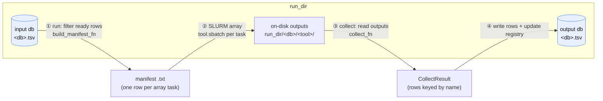
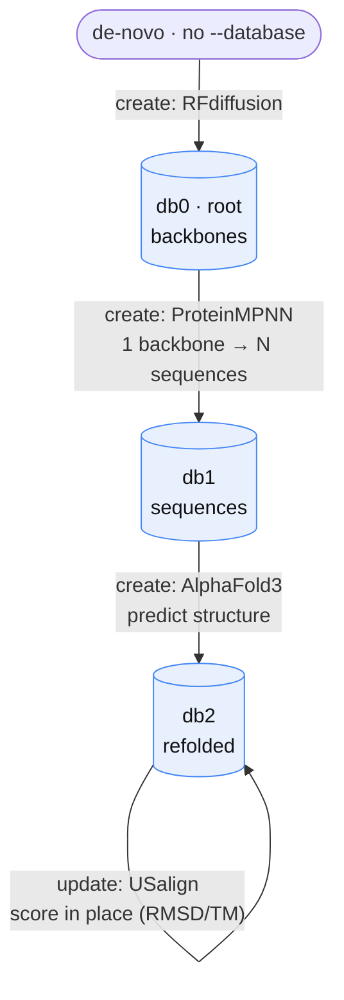

# prosapia

**A data layer for protein design on HPC.** `prosapia` gives many heterogeneous
protein-design tools (RFdiffusion, ProteinMPNN, AlphaFold3, ColabFold, Boltz,
USalign, Rosetta, …) a single way to exchange results: a **shared tabular
database** that every tool reads from and writes back to. You bring the tools;
the package supplies the data format, the two-phase driver that runs them on
SLURM, and the lineage bookkeeping that ties their outputs together.

This is **not a pipeline framework.** There is no DAG to declare and no fixed
order of steps. Instead there is a *consensus data format* — the database — and
tools that consume and produce it. You compose a workflow simply by pointing the
next tool at a database, exploring, forking, and back-tracking as the science
demands. The database is the interface; the tools are interchangeable.

## Why a shared database?

Every protein-design tool speaks its own language on disk: RFdiffusion emits
backbones as PDBs, ProteinMPNN emits FASTA sequences, AlphaFold3 emits
structures plus confidence metrics. Stitching them together by hand means
bespoke glue for every pair of tools.

`prosapia` collapses that to one rule: **a design is a row, a database is a
table.** Each row is keyed by a design `name`; each tool contributes columns
(a path to a structure, a sequence, a pLDDT, an RMSD). A tool never has to know
which tool ran before it — it only has to read the columns it needs and write
the columns it produces. That uniformity is what lets arbitrary tools compose
without a hard-coded pipeline.

## How information flows

A tool runs in **two phases** against a `run_dir`. The shared driver owns the
flow; the tool fills in only the variable parts (which rows to submit, and how
to read the results back).



1. **run** — the driver opens the input database, keeps the rows that are
   *ready* (their input column is present and the tool hasn't already finished
   them), and hands them to the tool's `build_manifest_fn`, which writes a
   tab-separated **manifest** — one line per array task. The driver then submits
   a SLURM array job whose `.sbatch` consumes that manifest.
2. **compute** — SLURM runs the array. Each task cuts its own fields out of its
   manifest line and writes results under the tool's output directory
   (`run_dir/<db>/<tool>/`).
3. **collect** — the driver invokes the tool's `collect_fn`, which reads those
   on-disk outputs and returns rows (`CollectResult`) keyed by design `name`.
4. **write** — the driver writes those rows into the destination database and
   updates the registry. The manifest is transient scaffolding; the **database
   is the durable record.**

The tool contributes only steps ① `build_manifest_fn` and ③ `collect_fn` (plus
its `.sbatch`). Everything else — filtering, resume-on-rerun, SLURM submission,
lineage stamping, database writes — is the shared driver.

## Databases compose into a lineage

A tool's `action` decides how its output database relates to its input:

- **`create`** reserves a **new child database** (a new generation, `gen+1`) and
  links each new row back to its parent row. Use this when the tool *produces
  new entities* — e.g. ProteinMPNN turns one backbone into many sequences.
- **`update`** annotates the **same database in place**, adding columns to
  existing rows. Use this when the tool *scores or refines* the designs already
  in the table — e.g. an AlphaFold3 confidence pass, or a structural alignment.

A **root** database (`gen 0`) starts a fresh lineage — a `create` tool run with
no `--database`. From there, databases form a tree, catalogued in the run's
`_registry.tsv`. Because every row records its `parent_db`/`parent_name`, a
`lookup` can walk the chain to inherit an ancestor's value, so a downstream tool
can read a property set generations earlier without copying it forward.



Nothing about this tree is declared up front. Each edge is just one more `sapia
run` / `sapia collect` pointed at a database — so branching (try two ProteinMPNN
settings from the same backbones) is just running the tool twice with different
labels.

## Anatomy of a run_dir

```
run_dir/
├── _registry.tsv          # catalog of every database + its lineage (parent, gen)
├── db0.tsv                # a database: one row per design, keyed by `name`
├── db1_seqs.tsv           # a child database (another generation)
├── .manifests/            # transient per-run manifests
└── db0/                   # per-database, per-tool outputs on disk
    └── rfdiffusion/
        ├── <design>.pdb
        └── ...
```

The `*.tsv` databases are the shared data format; the nested directories are
where tools drop their raw artifacts and where `collect_fn` reads them from.

## Quick start

```bash
sapia init                                 # one-time: shell tab-completion
RUN_DIR=$(sapia new_run --label demo)      # create a run_dir (prints its path)

# create a root database of backbones, then collect the results back in
sapia run     rfdiffusion "$RUN_DIR" ...
sapia collect rfdiffusion "$RUN_DIR" -d db0

# design sequences for those backbones into a child database
sapia run     mpnn_seqs   "$RUN_DIR" -d db0 ...
sapia collect mpnn_seqs   "$RUN_DIR" -d db1
```

`run_dir` is a positional argument to every tool; `-d/--database` names the
database to consume (omit it on a `create` tool to start a fresh root lineage).
Only `sapia new_run` mints a `run_dir`; tools always operate inside an existing
one.

## A tool is four small pieces

A tool carries **no orchestration logic** — the driver supplies that. It is:

| Piece | What it is |
| --- | --- |
| **metadata** (`ToolMetadata`) | `name`, `description`, and `action` (`create`/`update`). |
| **`build_manifest_fn`** | reads the ready rows, returns one manifest line per array task. |
| **`collect_fn`** | a per-design collector; the driver stamps status/path and writes the rows. |
| **`tool.sbatch`** | the per-array-task script; receives the manifest and out_dir. |

An optional `tool_worker.py` can do extra Python work per task; if the per-design
step is a simple shell command, put it directly in `tool.sbatch` instead.

## Customizing tools

The bundled tools are intentionally general and may not fit every workflow.
There are three ways to adapt them, from lightest to heaviest.

### 1. Reuse a bundled tool, override just what you need

`Tool` is a frozen dataclass; `get_builtin` fetches a bundled one and
`with_overrides` returns a copy with some fields swapped. In your own tool's
`spec.py`, reuse everything and replace only the hook that differs:

```python
from prosapia.core import get_builtin
from .my_collect import my_collect_fn

TOOL = get_builtin("rfdiffusion").with_overrides(collect_fn=my_collect_fn)
```

### 2. Fork a whole tool

To start from a working copy and edit freely:

```bash
sapia fork-tool rfdiffusion            # -> ./tools/rfdiffusion/
sapia fork-tool rfdiffusion my_rfdiff  # -> ./tools/my_rfdiff/
```

Then edit the copy's `spec.py` / `run_*` / `collect_*`.

### 3. Write a tool from scratch

Add a folder with a `spec.py` exporting `TOOL = Tool(...)`, a `run_*` manifest
builder, a `collect_*` function, and a `.sbatch`.

### How tools are discovered (and how override wins)

`sapia` scans the built-in tools dir first, then every dir in
`$PROSAPIA_TOOLS_DIR` (os.pathsep-separated, default `./tools`). Tools are keyed
by the `name` in their `spec.py`, and **later dirs win** — so a tool whose
`name` matches a built-in **shadows** it, while a new `name` registers a **new**
tool alongside the built-ins.

```bash
export PROSAPIA_TOOLS_DIR=./tools   # already the default
```

## Writing a `.sbatch`

Every tool's `.sbatch` receives two positional args and should source the shared
prelude, which the driver locates for it via `$SAPIA_PRELUDE`:

```bash
#!/bin/bash
#SBATCH ...

# Sets MANIFEST ($1), OUT_DIR ($2), and SAPIA_LINE (this array task's manifest line).
source "${SAPIA_PRELUDE:?}"

# Use $SAPIA_LINE and $OUT_DIR directly:
name=$(echo "$SAPIA_LINE" | cut -f1)
src=$(echo "$SAPIA_LINE"  | cut -f2)
...
```

The prelude is the one place the per-task boilerplate lives; tools cut their own
fields out of `$SAPIA_LINE` and write results under `$OUT_DIR`.

## Writing a collect function

A tool's `collect_fn` only has to locate and parse **one** design's output and
yield a `Collected(...)` per row it produced. The driver iterates the ready
designs, and stamps the `<leaf>_status` / `<leaf>_path` / `parent_name` columns
for you — no tool writes those by hand.

See **[docs/writing-a-collect-function.md](docs/writing-a-collect-function.md)**
for the full contract, with worked `update` and `create` examples.

## Installation

`prosapia` is a `uv`-managed package that installs the `sapia` CLI.

```bash
uv sync           # install into the project environment
uv run sapia ...  # invoke the CLI
```
