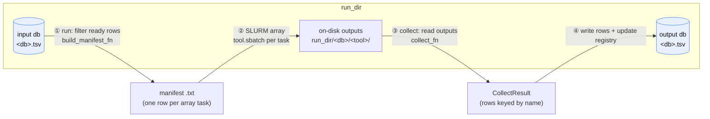

# Architecture

## Why a shared database?

Every protein-design tool speaks its own language on disk: RFdiffusion emits
backbones as PDBs, ProteinMPNN emits FASTA sequences, AlphaFold3 emits structures
plus confidence metrics. Stitching them together by hand means bespoke glue for
every pair of tools.

`prosapia` collapses that to one rule: **a design is a row, a database is a
table.** Each row is keyed by a design `name`; each tool contributes columns
(a path to a structure, a sequence, a pLDDT, an RMSD). A tool never has to know
which tool ran before it — it only reads the columns it needs and writes the
columns it produces. That uniformity is what lets arbitrary tools compose without
a hard-coded pipeline.

Databases are stored as `.tsv` by default, but the [`DataManager`](#the-drivers)
handles them uniformly as DataFrames through a pluggable I/O backend, so the
on-disk format is not load-bearing.

## The two-phase execution model

A tool runs in **two phases** against a `run_dir`. The shared driver owns the
flow; the tool fills in only the variable parts (which rows to submit, and how to
read the results back).



1. **run** (`sapia run`) — the driver opens the input database, keeps the rows
   that are *ready* (their input column is present and the tool hasn't already
   finished them), and hands them to the tool's `build_manifest_fn`, which writes
   a tab-separated **manifest** — one line per array task. The driver then submits
   a SLURM array job whose `.sbatch` consumes that manifest.
2. **compute** — SLURM runs the array. Each task cuts its own fields out of its
   manifest line and writes results under the tool's output directory
   (`run_dir/<db>/<tool>/`).
3. **collect** (`sapia collect`) — the driver invokes the tool's `collect_fn`,
   which reads those on-disk outputs and returns rows (`CollectResult`) keyed by
   design `name`.
4. **write** — the driver writes those rows into the destination database and
   updates the registry. The manifest is transient scaffolding; the **database is
   the durable record.**

The tool contributes only steps ① `build_manifest_fn` and ③ `collect_fn` (plus
its `.sbatch`). Everything else — filtering, resume-on-rerun, SLURM submission,
lineage stamping, database writes — is the shared driver.

## The drivers

The `prosapia.core` package provides the two drivers, the tool-definition types,
and the data layer.

| Module | Responsibility |
| --- | --- |
| `tool.py` | `Tool` (metadata + the two hooks) and `ToolMetadata` (`name`, `description`, `action`). |
| `base_sbatch.py` | `run_from_args(...)` — the submit-phase driver, shared by all tools. Resolves the destination db, calls `build_manifest_fn`, submits the SLURM array. |
| `base_collect.py` | `collect_from_args(...)` — the collect-phase driver. Invokes `collect_fn`, writes rows, updates the registry. |
| `data_manager.py` | `DataManager` — owns the run's databases and registry as DataFrames, resolves cross-db lineage, and exposes a read-only `lookup`. |
| `cli.py` | The `sapia` entrypoint. |

A **tool** is a composition of declarative metadata, two behavioral hooks, and
scripts. It carries no orchestration logic of its own — the drivers supply that.
See [Writing a tool](writing-a-tool.md).

## Anatomy of a `run_dir`

Design workflows live inside a unique `run_dir`. Every tool needs one;
`sapia new_run` mints a fresh one.

```
run_dir/
├── _registry.tsv          # catalog of every database + its lineage (parent, gen)
├── db0.tsv                # a database: one row per design, keyed by `name`
├── db1_seqs.tsv           # a child database (another generation)
├── .manifests/            # transient per-run manifests
└── db0/                   # per-database, per-tool outputs on disk
    └── rfdiffusion/
        ├── <design>.pdb
        └── ...
```

The `*.tsv` databases are the shared data format; the nested directories are
where tools drop their raw artifacts and where `collect_fn` reads them from.

Next: how databases relate to each other in [Lineage & databases](lineage-and-databases.md).
