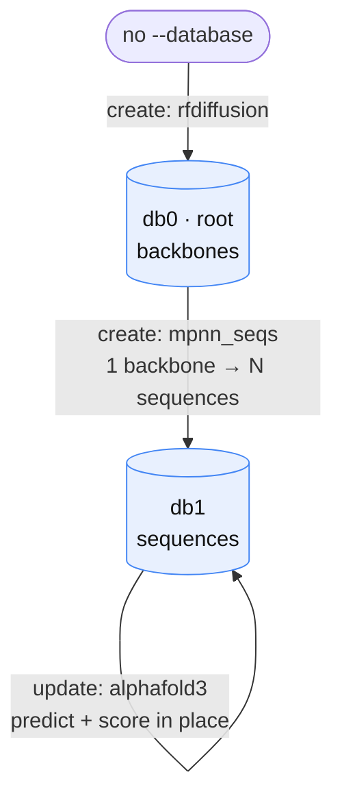

# Lineage & databases

## The governing rule

**When a protein diverges in sequence or structure, it is no longer the same protein but a child of a parent — so it needs a new database.**

Everything about how databases relate to each other follows from this. A database holds designs that are "the same entity" observed across tools; a *new* database is born the moment a tool creates genuinely new entities.

## `create` vs. `update`

A tool's `action` encodes which side of that rule it falls on:

### `create` — new entities, new database

`create` reserves a **new child database** (a new generation, `gen+1`) and links
each new row back to its parent row. Use it when the tool *produces new entities*:

- **RFdiffusion** emits new backbones — and swaps side chains for glycines, so even a single diffusion yields a new *sequence*. Multiple diffusions share that glycine sequence but are different *structures*. Either way: new entities.
- **ProteinMPNN** turns one backbone into many new sequences — one parent row fans out to N child rows.

### `update` — a property of an existing entity, same database

`update` annotates the **same database in place**, adding columns to existing rows. Use it when the tool *measures a property* of designs that already exist:

- **AlphaFold3 / ColabFold / OpenFold3 / Boltz** predict a structure for a  sequence. That structure is a **property of that protein** just like its prediction metrics. So it annotates the row in place rather than minting a generation.
- **USalign** scores a structure (RMSD / TM-score) — again, a property written back onto the existing row.

> [!NOTE]
> While a `create` tool's `sapia run` and `sapia collect` point to separate databases, an `update` tool's point to the same one.

## Roots and the lineage tree

A **root** database (`gen 0`) starts a fresh lineage: a `create` tool run with no
`--database`. From there, databases form a tree, catalogued in the run's
`_registry.tsv`.



Nothing about this tree is declared up front. Each edge is just one more `sapia run` / `sapia collect` pointed at a database — so branching (e.g. trying two ProteinMPNN settings from the same backbones) is just running the tool twice
with different labels.

To produce this pipeline, the CLI inputs would look like this:
```bash
# de-novo backbones → a root database
sapia run     rfdiffusion "$RUN_DIR" ...
sapia collect rfdiffusion "$RUN_DIR" -d db0

# design sequences for those backbones → a child database
sapia run     mpnn_seqs   "$RUN_DIR" -d db0 ...
sapia collect mpnn_seqs   "$RUN_DIR" -d db1

# predict structures and score them *in place* on the sequence database
sapia run     alphafold3  "$RUN_DIR" -d db1 ...
sapia collect alphafold3  "$RUN_DIR" -d db1
```

## Inheriting values across generations: `lookup`

Because every row records its `parent_db` / `parent_name` (and `gen`), a `lookup` function walks the lineage chain to inherit an ancestor's value. A downstream tool can read a property set generations earlier without copying it forward at every step — the lineage links are the single source of truth, and `DataManager` resolves them for you.
